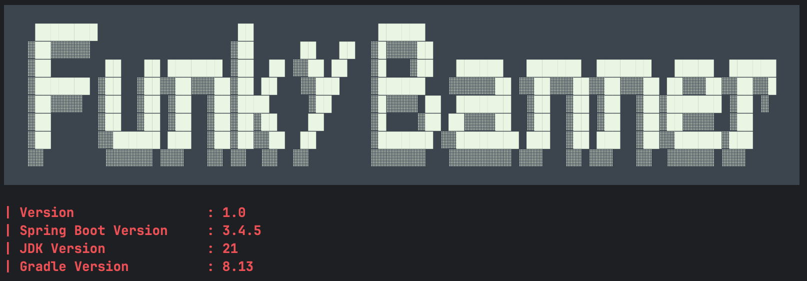
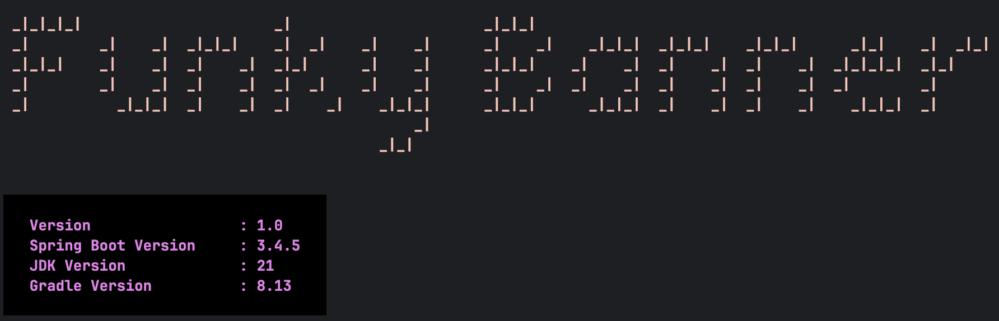
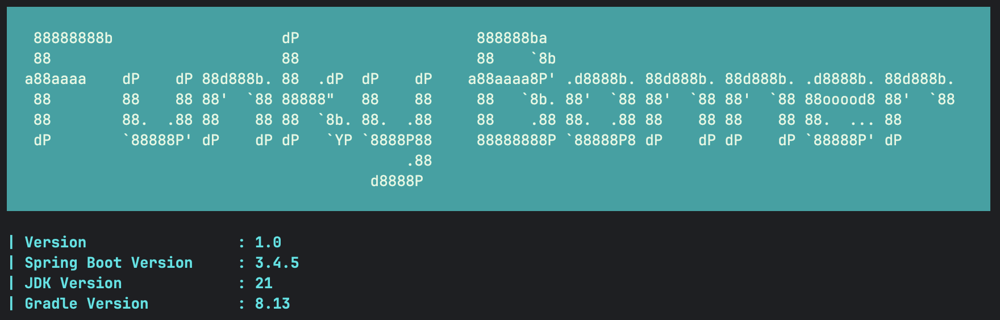
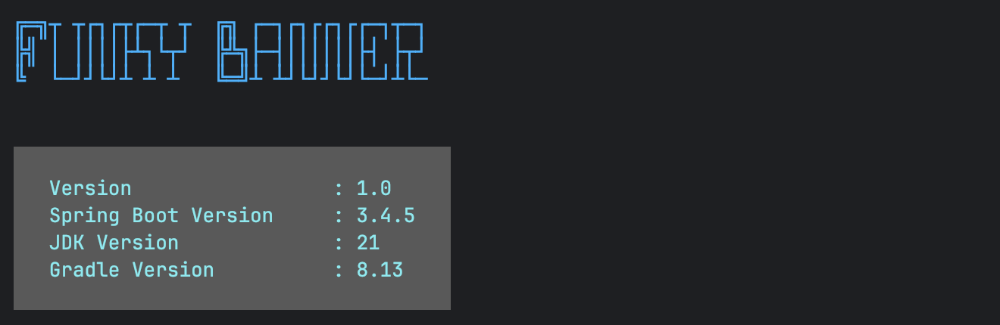
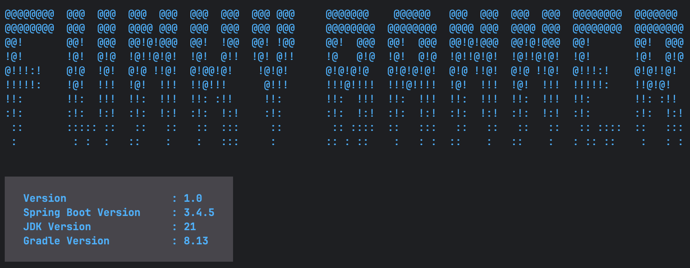
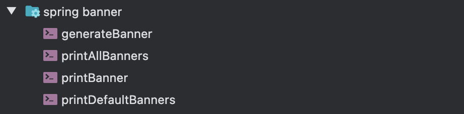

# Spring Banner Gradle Plugin

Spring Banner Gradle Plugin is for Spring Boot applications and it generates fun and colorful banners. Opinionated defaults are chosen
for the best banner experience. All you have to do is include the plugin to your build file.

#### Requirement:
JDK: 17+
SpringBoot: 3.x.x

#### Usage:

```kotlin
plugins {
    ..
    ..
    id("io.github.bhuyanp.spring-banner-gradle-plugin").version("1.0")
}
```

#### Previews
<details>
<summary>Dark Theme Preview:</summary>


</details>
<details>
<summary>Light Theme Preview:</summary>


</details>

<details>
<summary>Surprise Me:</summary>










</details>

#### Credits:

This plugin is inspired by [spring-banner-gradle-plugin](https://alexengrig.github.io/spring-banner-gradle-plugin/)

Colorizer by [JColor](https://github.com/dialex/JColor?tab=readme-ov-file)

## Tasks

Plugin comes with four tasks.



```kotlin
- GenerateBanner [DEFAULT]
    Writes generated banner.txt to the application resources folder.

- PrintBanner
    Prints banner in the console as per current app's configuration.

- PrintAllBanners
    Prints banners in the console using all the fonts available in the library.ππ

- PrintDefaultBanner
    Prints banners in the console using all the default fonts plugin cycles through.
```

## Customizations

Plugin comes with ample customizable features. You can pick and choose which part you want to customize.

### Text

Banner text that appears at the top. If not provided, plugin takes project name, removes dashes from it and capitalizes the first letter of every word.
Custom texts can be provided as shown below.

```gradle
springBanner {
    text = "Funky Banner"
}
```

### Banner Fonts

You can provide one or more banners fonts to the plugin. For more than one fonts, plugin will randomly pick font everytime it is invoked.
If no fonts are provided then plugin randomly cycles through a chosen list of fonts. DEFAULT_FONTS can be found here. [SpringBannerExtension](plugin/src/main/java/io/github/bhuyanp/gradle/SpringBannerExtension.java)

```gradle
springBanner {
    bannerFonts = listOf(
        "ansiregular",
        "ansishadow",
        "banner3_d",
        "banner4",
        "bigmoneyne",
        "bolger"
    )
}
```

### Caption

Caption appears below the banner and this section can be be used to display useful information about the application. Plugin provides default caption with several useful
info about the application. Check the screenshots for default caption. Custom captions can be provided as shown below. For no caption, pass an empty string.

```gradle
springBanner {
// for custom caption
    caption = """
        Caption text line 1
        Caption text line 2
        Caption text line 3
    """.trimIndent()
    
// for no caption
caption = ""
}
```

### Theme

Spring banner generator comes with two global themes, DARK and LIGHT. DARK is default. You can change the theme as shown below.

```gradle
springBanner {
   // Dark is default when no themePreset is provided
   themePreset = ThemePreset.DARK / ThemePreset.LIGHT / ThemePreset.SURPRISE_ME
}
```

### Banner and Caption Theme Customization

Default theme of banner and caption derived from the Theme Preset can be overridden. You can customize them to
your heart's content.

```gradle
springBanner {
    bannerTheme = ThemeConfig(BRIGHT_WHITE_TEXT(), BACK_COLOR(70, 45, 95), BOLD())
    captionTheme = ThemeConfig(CYAN_TEXT(), NONE(), ITALIC())
}
```
Recommended order to provide the theme config is TEXT COLOR, BACKGROUND COLOR, EFFECT.


Refer [Attribute.java](plugin/src/main/java/io/github/bhuyanp/gradle/ansi/Attribute.java) for more color and formatting options.
You can pass the attributes in any order. Plugin prints the theme config used when set to SURPRISE_ME Theme Preset into the build log. If you like the randomly generated
banner, you may copy the banner and caption theme to your build file for future use. 

## Maven Plugin

Maven plugin with simillar functionality located at https://github.com/bhuyanp/spring-banner-maven-plugin

## License

This project is [licensed](LICENSE) under
[Apache License, version 2.0](https://www.apache.org/licenses/LICENSE-2.0).
