# Spring Banner Generator

Spring Banner Generator gradle plugin is for SpringBoot applications and it generates fun and colorful banners. Opinionated defaults are chosen
for the best banner experience. All you have to do is include the plugin to your build file.

#### Usage:
```kotlin
plugins {
    ..
    ..
    id("io.github.bhuyanp.spring-banner-generator")
}
```
#### Samples:

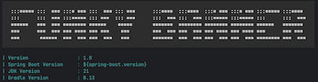
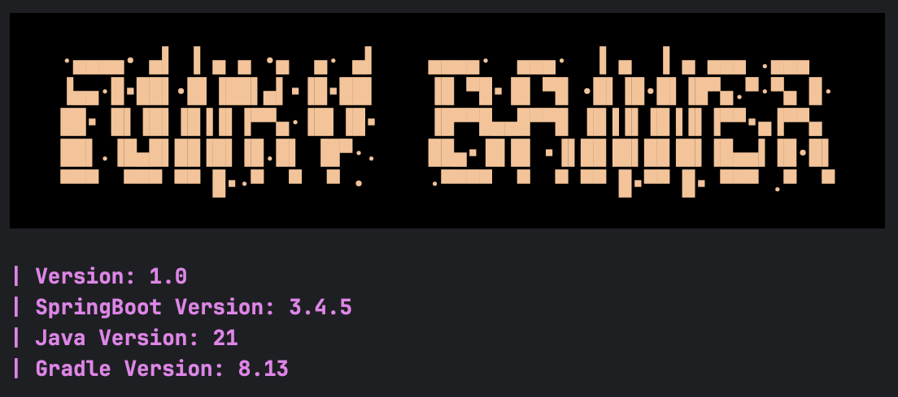
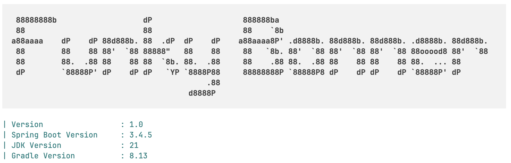
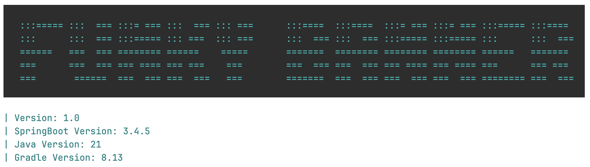

#### Credits:
This plugin is inspired by [spring-banner-gradle-plugin](https://alexengrig.github.io/spring-banner-gradle-plugin/)

Colorizer by [JColor](https://github.com/dialex/JColor?tab=readme-ov-file)

## Tasks

Plugin comes with three tasks.


### GenerateBannerTask [DEFAULT]

Writes generated banner.txt to resources folder.

### PrintBannerTask

Prints banner in the console as per current app's configuration

### PrintAllBannerTask

Prints banners in the console using all the fonts available in the library

## Customizations

Plugin comes with ample customizable features. You can pick and choose which part you want to customize.

### Text

Banner text that appears at the top. If not provided, plugin takes project name, removes dashes from it and capitalizes the first letter of every word.
Custom texts can be provided as shown below.

```gradle
springBanner {
    text = "Funky Banner"
}
```

### Banner Fonts

You can provide one more banners fonts to the plugin. For more than one fonts, plugin will randomly pick font everytime it is invoked.
If no fonts are provided then plugin randomly cycles through a chosen list of fonts. DEFAULT_FONTS can be found here. [SpringBannerExtension](plugin/src/main/java/io/github/bhuyanp/gradle/SpringBannerExtension.java)

```gradle
springBanner {
    bannerFonts = listOf(
        "ansiregular",
        "ansishadow",
        "banner3_d",
        "banner4",
        "bigmoneyne",
        "bolger"
    )
}
```

### Caption

Caption appears below the banner and this section can be be used to display useful information about the application. Plugin provides default caption with several useful
info about the application. Check the screenshots for default caption. Custom captions can be provided as shown below.

```gradle
springBanner {
    caption = """
        Caption text line 1
        Caption text line 2
        Caption text line 3
    """.trimIndent()
}
```

### Theme

Spring banner generator comes with two global themes, DARK and LIGHT. DARK is default. You can change the theme as shown below.

```gradle
springBanner {
    theme = Theme.LIGHT
}
```
Find the easter egg and you will have a lot of fun.

#### Dark Theme [Default]:

<details>
<summary>Examples</summary>

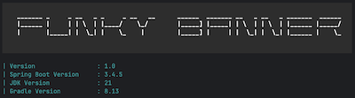
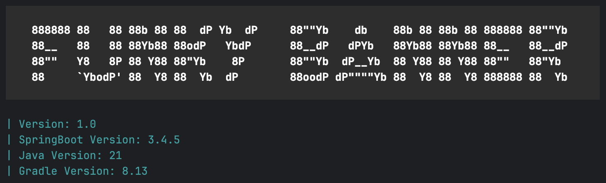
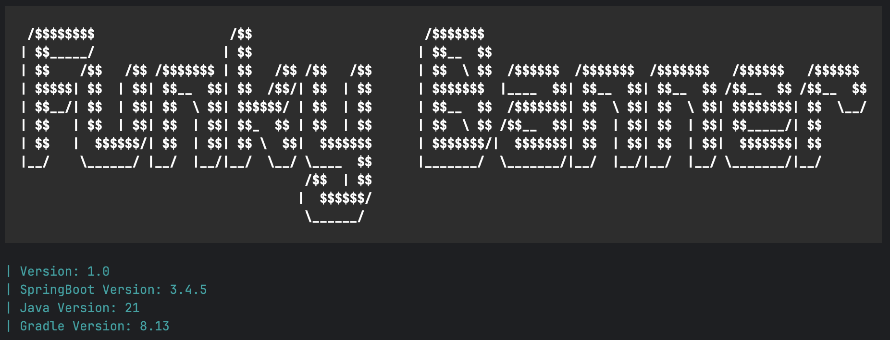

</details>

#### Light Theme:

<details>
<summary>Examples</summary>
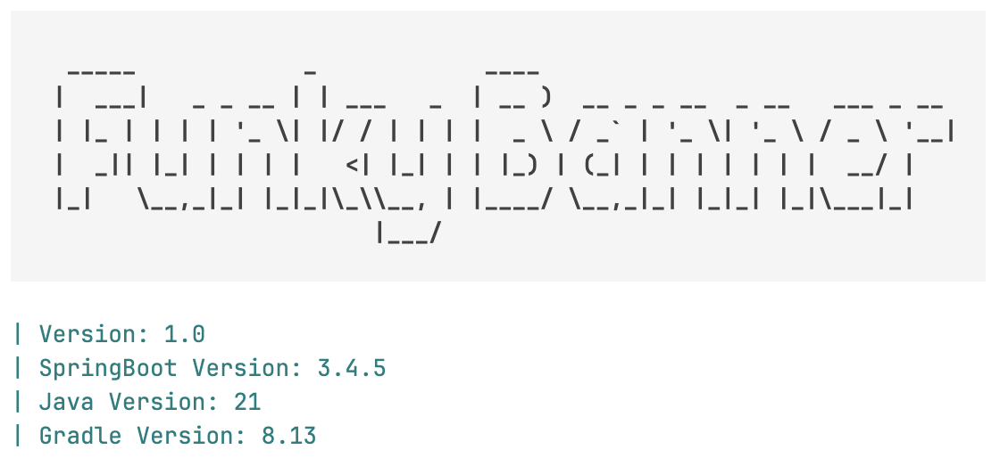

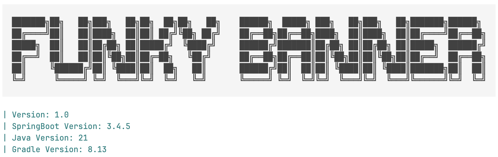
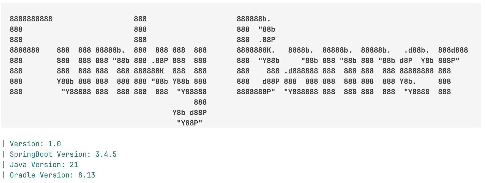
</details>

### Banner and Caption Theme Customization

Default theme of banner and caption derived from the global theme can be overridden. You can customize them to
your heart's content.

```gradle
springBanner {
    bannerTheme = ThemeBuilder(BRIGHT_WHITE_TEXT(), BACK_COLOR(70, 45, 95), BOLD())
    captionTheme = ThemeBuilder(CYAN_TEXT(),BOLD())
}
```

Refer [Attribute](https://github.com/dialex/JColor/blob/main/src/main/java/com/diogonunes/jcolor/Attribute.java) for more color and formatting options.
You can pass the attributes in any order. Avoid using back color for caption theme.

#### Customized Theme:

<details>
<summary>Examples</summary>
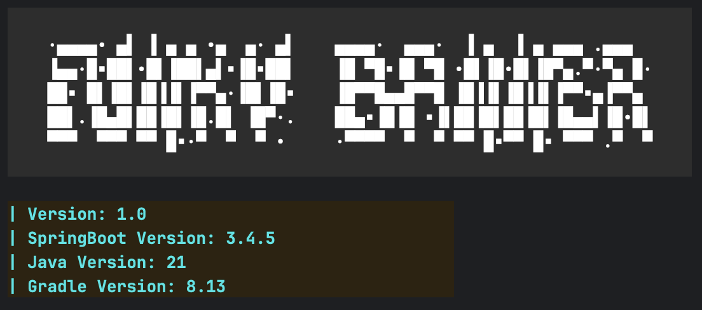
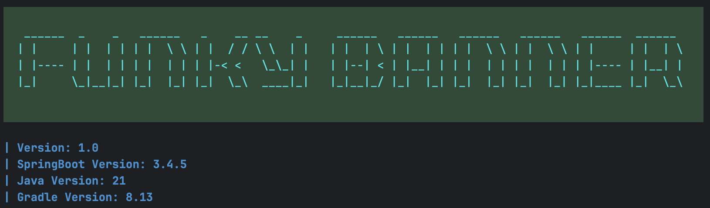
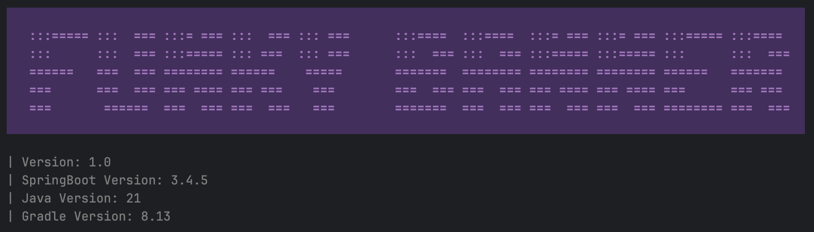

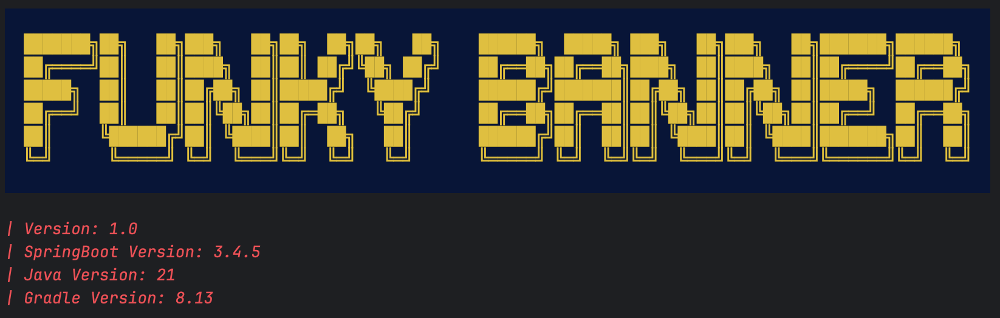

</details>

## License

This project is [licensed](LICENSE) under
[Apache License, version 2.0](https://www.apache.org/licenses/LICENSE-2.0).
