# Spring Banner Gradle Plugin

Spring Banner Gradle Plugin is for Spring Boot applications and it generates fun and colorful banners. Opinionated defaults are chosen
for the best banner experience. All you have to do is include the plugin to your build file.

#### Requirement:
JDK: 17+
SpringBoot: 3.x.x

#### Usage:

```kotlin
plugins {
    ..
    ..
    id("io.github.bhuyanp.spring-banner-gradle-plugin").version("1.2")
}
```

#### Previews

Run this command to preview the banner in different fonts.
```bash
./gradlew printDefaultFonts
```

<details>
<summary>Dark Theme:</summary>
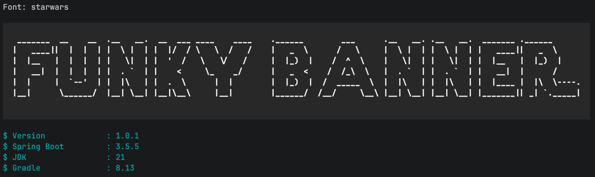
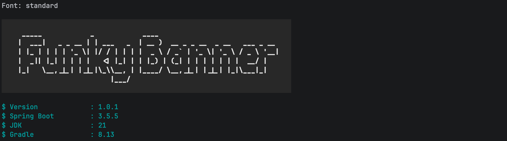
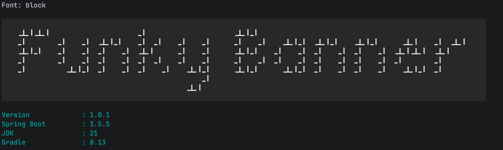
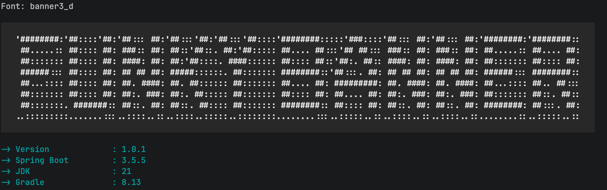
</details>
<details>
<summary>Light Theme:</summary>
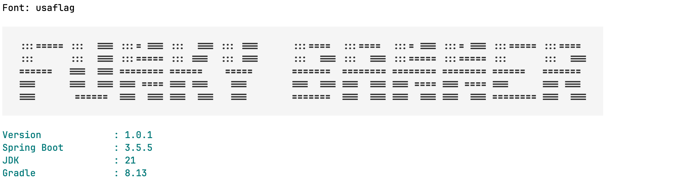
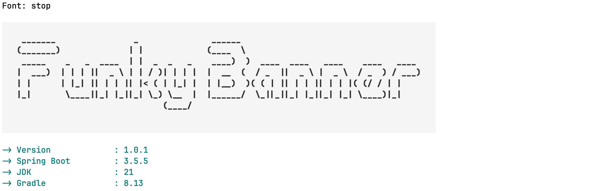
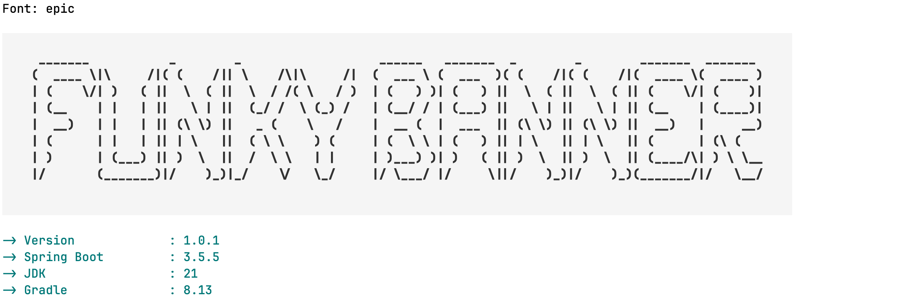
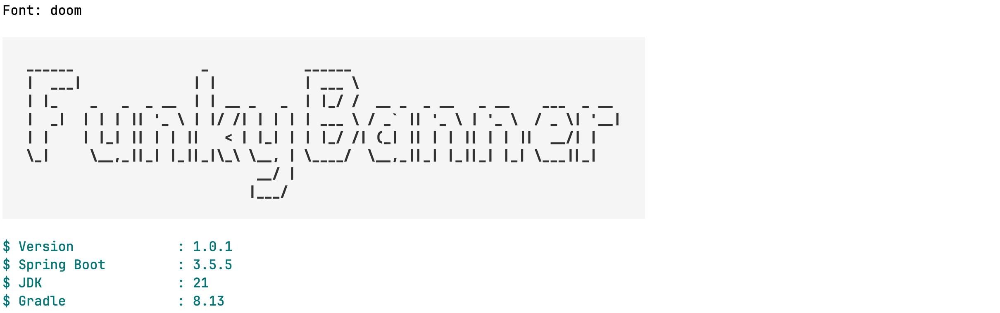
</details>

<details>
<summary>Surprise Me Theme:</summary>
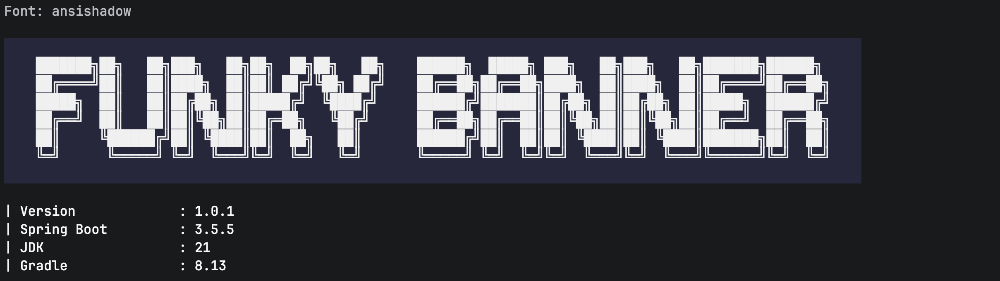
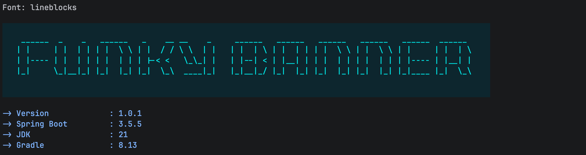
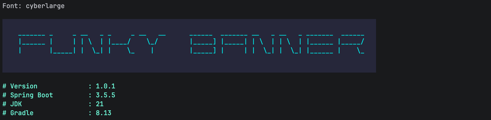
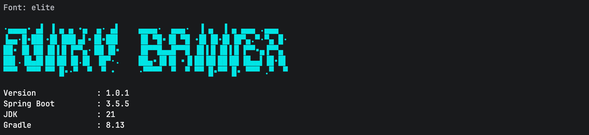
</details>

<details>
<summary>Surprise Me Light Theme:</summary>
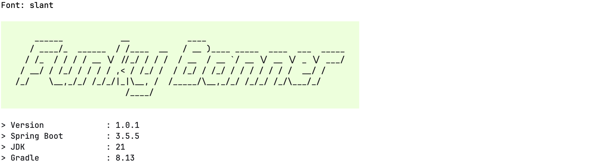
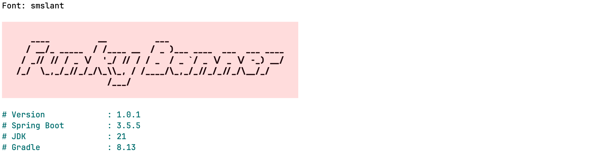
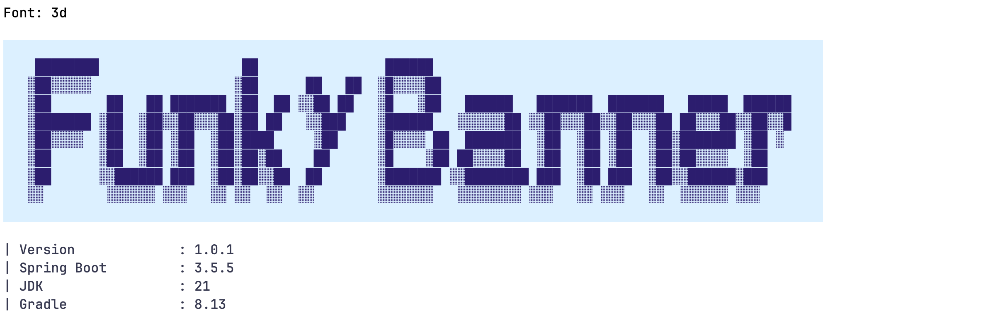
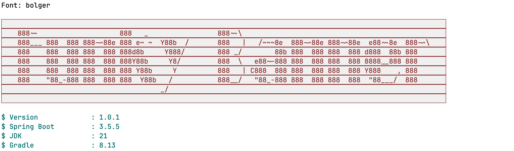
</details>


## Tasks

Plugin comes with four tasks.

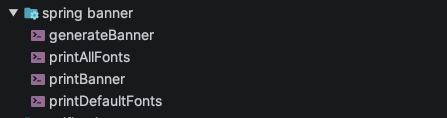

```kotlin
- GenerateBanner [DEFAULT]
    Writes generated banner.txt to the application resources folder

- PrintBanner
    Prints banner in the console as per current project configuration

- PrintAllFonts
    Prints banners in the console using all the fonts available in the library

- PrintDefaultFonts
    Prints banners in the console using all the default fonts plugin cycles through when no custom fonts are provided
```

## Customizations

Plugin comes with ample customizability. You can pick and choose which part you want to customize.

### Generate Banner
```gradle
springBanner {
    generateBanner = true // Flag to generate top section of the banner. Default is true.
}
```

### Generate Caption
```gradle
springBanner {
    generateCaption = true // Flag to generate bottom section(caption) of the banner. Default is true.
}
```

### Banner Text
Banner text that appears at the top. If not provided, plugin takes project name, removes dashes from it and capitalizes the first letter of every word.
Custom texts can be provided as shown below.
```gradle
springBanner {
    bannerText = "Funky Banner"
}
```

### Theme Preset
Check the screenshots for the themes generated by different theme presets. SURPRISE_ME is default and it generates random theme for the banner and caption every time it is invoked.
For details about other theme presets, refer [THEME_PRESET](spring-banner-gradle-plugin/src/main/java/io/github/bhuyanp/gradle/theme/THEME_PRESET.java)
```gradle
springBanner {
    themePreset =
        THEME_PRESET.SURPRISE_ME // Theme preset to use for the banner styling. Default is SURPRISE_ME. Other options include DARK, LIGHT, SURPRISE_ME_LIGHT etc.
}
```

### Banner Fonts

You can provide one or more banners fonts to the plugin. For more than one fonts, plugin will randomly pick font everytime it is invoked.
If no fonts are provided then plugin randomly cycles through a chosen list of fonts. DEFAULT_FONTS can be found here. [Constants.java](spring-banner-gradle-plugin/src/main/java/io/github/bhuyanp/gradle/common/Constants.java)
```gradle
springBanner {
    bannerFonts = listOf(
        "ansiregular",
        "ansishadow",
        "banner3_d",
        "banner4",
        "bigmoneyne",
        "bolger"
    )
}
```

### Caption

Caption appears below the banner and this section can be used to display useful information about the application. Plugin provides default caption with several useful
info about the application. Check the screenshots for default caption. Fine grain control over the caption can be achieved using CaptionSetting as shown below. 

You can choose to hide certain info from the caption, change the bullet style and even provide custom caption text.

```gradle
springBanner {
    captionSetting =
        CaptionSetting.builder() // Caption settings for the fine grain control over banner caption. It includes options like caption bullet style, whether to hide several versions etc.
            .text(
                """ 
            App: ${'$'}appVersion
            Spring Boot: ${'$'}springBootVersion
            JDK: ${'$'}jdkVersion
            Gradle: ${'$'}gradleVersion
            XYZ Library: 1.0.0
        """.trimIndent())
            /* Custom caption text to override default caption generated by the plugin. Default caption includes Spring Boot version, JDK version and Gradle version. You can use the following variables in the caption text to include dynamic values:
                    ${'$'}appVersion - The version of your application (from build file)
                    ${'$'}springBootVersion - The version of Spring Boot being used
                    ${'$'}jdkVersion - The version of JDK being used
                    ${'$'}gradleVersion - The version of Gradle being used
             */
            .hideAppVersion(false) // Whether to hide the app version in the caption. Default is false.
            .hideSpringBootVersion(false) // Whether to hide the Spring Boot version in the caption. Default is false.
            .hideJDKVersion(false) // Whether to hide the JDK. Default is false.
            .hideGradleVersion(false) // Whether to hide the Gradle version in the caption. Default is false.
            .captionBulletStyle(CaptionSetting.CAPTION_BULLET_STYLE.GT) // Bullet style to use for the caption. Default is GT (greater than symbol). Other options include PIPE("|"),GTA("->"),POUND("#"),DASH("-"),DOLLAR("$"),RANDOM("Random"),NONE("").
            .build() // Caption settings for the fine grain control over banner caption. It includes options like caption bullet style, whether to hide several versions etc.
}
```

## IntelliJ Plugin
IntelliJ plugin with similar functionality and lot more customizability located at [Funnky Banners](https://plugins.jetbrains.com/plugin/29672-funky-banners)


## Maven Plugin
Maven plugin with similar functionality located at https://github.com/bhuyanp/spring-banner-maven-plugin

## License

This project is [licensed](LICENSE) under
[Apache License, version 2.0](https://www.apache.org/licenses/LICENSE-2.0).

## Credits

- [Figlet](http://www.figlet.org)
- [JFiglet](https://github.com/dtmo/jfiglet)
- [spring-banner-gradle-plugin](https://alexengrig.github.io/spring-banner-gradle-plugin/)
- Colorizer by [JColor](https://github.com/dialex/jcolor)

## Love the Plugin?

Please consider supporting our efforts.

<a href="https://buymeacoffee.com/bhuyanp"></a>
